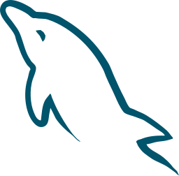

# Hi 👋 !

# I'm Mahmoud G. Mansour
> <small style='font-size:12px;'>A place to mine Gold and Diamond! </small>

> Student in computer programing with a background in Java application, Python, C++, Js, HTML, CSS, MySQL, and databases. proficiency with algorithms and data structures in c++ and python. Experience working on many projects.

# Frontend Technologies

  
  
  
  
  
  

  

 
 
  
 

# Backend Technologies

  

  
  
  
  

  

 
  
 

# Tools

  
  
  
  
  
   

   
 # skills
  
✅ HTML  
✅ CSS  
✅ Git and GitHub  
✅ Bootstrap  
✅ JavaScript  
✅ React  
✅ Python  
✅ C++  
✅ Data Stractures and Algorithms 
✅ Data Analysis  
  
  --- 
 
 
  

  

<!-- ## Tech Stacks
- MEEN Stack
- MERN Stack
- JAM Stack
- MRF Stack
 -->
